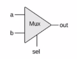

# Nand2Tetris

a simple [MOOC](https://www.coursera.org/learn/build-a-computer/home/welcome) on coursera provided by the university of jeruslem.

- [Website](https://www.nand2tetris.org)


## WEEK #1 

Elementary Logic Gates | 16-bit varients | Multiway varients
-----------------------|-----------------|------------------
- Not | - Not16 | - Or8Way
- And | - And16 | - Mux4Way16
- Or | - Or16 | - Mux8Way16
- Xor | - Mux16 | - DMux4Way
- Mux | - DMux8Way 
- DMux | 

- Why These 15 Particular Gates?
    + They are commonly used gates.
    + They compirse all the elementry logic gates needed to build our computer.

### Multiplexor
- diagram

    

- brief
  ```HDL
  if (sel==0)
      out=a
  else
      out=b
  ```

- truth table
  
  a | b | sel | out
  --|---|-----|----
  0 | 0 | 0 | **0**
  0 | 1 | 0 | **0**
  1 | 0 | 0 | **1**
  1 | 1 | 0 | **1**
  0 | 0 | 1 | **0**
  0 | 1 | 1 | **1**
  1 | 0 | 1 | **0**
  1 | 1 | 1 | **1**

- abbreviated truth table
  
   | sel | out
  -|-----|----
   | 0 | a
   | 1 | b

- notes

    + A 2-way mux enables **selecting** and outputting one out of two possible inputs.
    + Widely used in:
        * Digital design
        * Communications networks