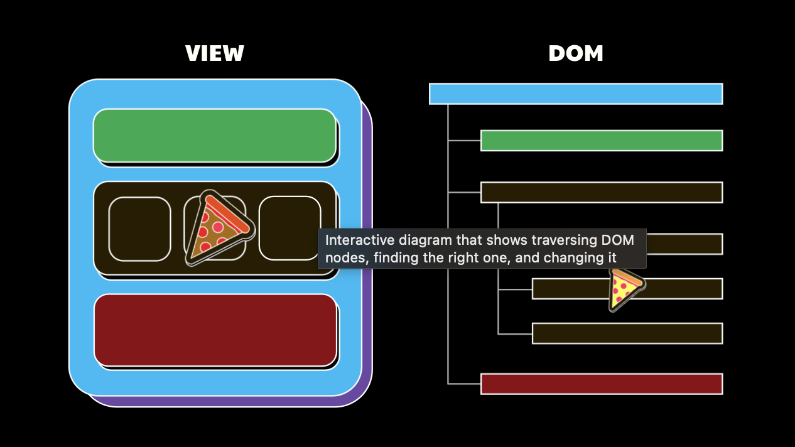

---
runme:
  id: 01HXDTNFZB9DXCT66J3HM4KVWP
  version: v3
---

> Note: The goal here is helping you establish a first-principles mental model for **how to think in React** than we are teaching you how to glue a bunch of npm packages together.
# React.js

## Course Instructions

1. helping you establish a first-principles mental model for how to think in React than we are teaching you how to glue a bunch of npm packages together.
2. solve quiz
3. if you find quiz difficult, re-study material
4. before you move onto the next section you'll be given a collection of challenges optimized for scenarios you'd see in real life. If you're able to get through all of these, you can feel confident that you're able to move on. And if at any point you get stuck and aren't sure what to do next, use gpt + stackoverflow.

## World Before React

when React first launched, it **was not well received**. Developers didn't like it. Because it was drastically different than anything that had come before it.

### Tech before React

in 2013, `JQuery`, `Backbone.js`, and `Angular.js` were the main stream.

#### JQuery

jQuery was the most popular way to build for the web. It embraced websites for what they truly were, a tree of DOM nodes. With jQuery, the **state** of your application **lived inside the DOM**. Whenever you wanted to update that state, **you'd imperatively traverse the DOM**, find the node you wanted to update, then update it. Needed to respond to an event? Again, traverse the DOM, find the node, then add an event listener to it.

jQuery revolutionized building for the web by *both* **creating a simple and unified abstraction** over **manipulating the DOM that worked in any browser** - regardless of typical browser compatibility issues (that's why jquery is used with modern tools like webflow to avoid those compatibility issues).

jQuery's **biggest blessing was also its biggest curse**. Turns out, **relying on shared mutable state was a bad idea**.

With jQuery, what started out as a simple way to update DOM state, typically devolved into a **mess of spaghetti like mutations that were both hard to predict and keep track of** if you weren't careful.

What jQuery needed was something that encouraged a little more structure. Something that gave a **backbone** to our applications.

> **Note**: another reason for why people stopped using jquery is the recent developments of EcmaScript (js) with modern features that replace a lot of the old hard way of doing things that led to using jquery for simplifying those things in first place.

## What is React

is a javascript framework for developing ui for web apps and sites.

## How React works?

react creates a virtual DOM that processes all data and 'reacts' to the original DOM

## Components

the web page is divided into sections (components) that could be made of other componenets.

